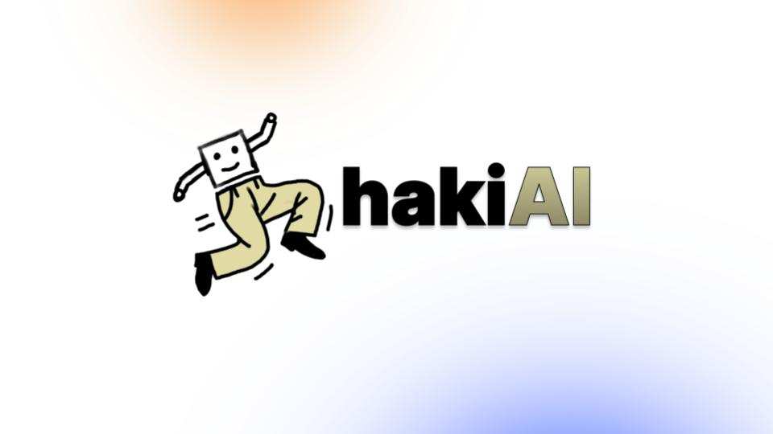

# Khaki AI
Made for PennApps XXV

**Won Most Creative Hack!** 🏆

## Inspiration
We set out to create a tool that unleashes dancers' creativity by syncing their moves with AI-generated music that matches perfectly. Inspired by the vibrant dance scenes on TikTok and Instagram, where beats and moves are inseparable, we wanted to take it to the next level. Imagine dancing to music made just for your style, effortlessly turning your moves into shareable, jaw-dropping videos with custom soundtracks. With our tool, dancers don’t just follow the beat—they create it! It's like having a DJ that grooves with you.

## What it does
KhakiAI allows users to upload or record short dance videos analyzed by our AI-powered system. The AI tracks the movements, tempo, and style of the dancer, generating a custom music track that perfectly matches the rhythm and energy of the performance. Users can further customize the music by selecting different genres or adding sound effects. The tool then syncs the music with the video, creating a seamless, high-quality dance video that can be shared directly on social media.

## How we built it
We used a complex tech stack involving several APIs, LLMs, and programming languages to build this project. Throughout our programming process, we broke up the task into various parts and pieced them together as we went. To begin, we focused on a key functionality of dance movement recognition with OpenPose/OpenCV. This recognition outputs a JSON that gets put into a MongoDB Database. Then, we use Llama, Tune AI, and Cerebras to pass the JSON through an LLM quickly to create a low latency, so that the prompt is generated quickly by the user. SunoAPI then uses the generated prompt to create music for the video. Then, we attach it with Python and output it.
